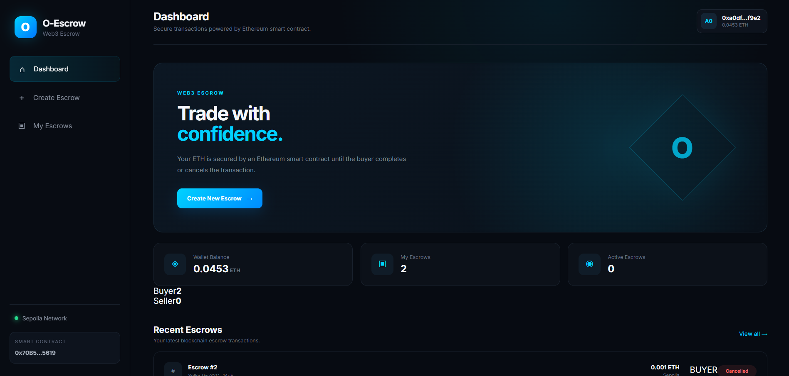
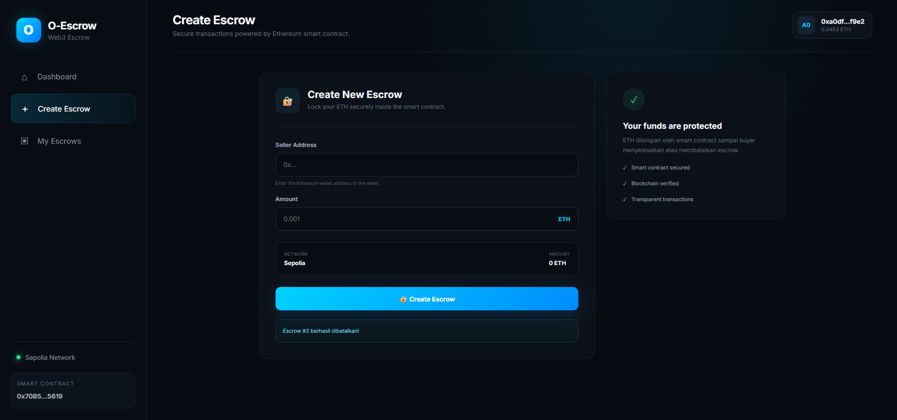

# O-Escrow

A decentralized ETH escrow DApp built on Ethereum Sepolia.

O-Escrow allows buyers to lock ETH inside a smart contract and release or refund the funds through on-chain transactions.

## Features

* 🔐 Create ETH escrow
* 💰 Lock ETH inside a smart contract
* ✅ Buyer can complete an escrow
* ↩️ Buyer can cancel an escrow
* 🦊 MetaMask wallet integration
* ⛓️ Ethereum Sepolia Testnet
* 📊 On-chain escrow data
* 🧪 Automated smart contract tests
* ⚡ React + TypeScript frontend
* 🔗 ethers.js Web3 integration

## How It Works

```text
Buyer
  │
  │ Create Escrow + ETH
  ▼
O-Escrow Smart Contract
  │
  ├── Complete
  │      ↓
  │    Seller
  │
  └── Cancel
         ↓
       Buyer
```

The ETH is held by the smart contract until the buyer completes or cancels the escrow.

## Tech Stack

### Smart Contract

* Solidity
* Ethereum
* Hardhat

### Frontend

* React
* TypeScript
* ethers.js
* MetaMask
* Vite

### Network

* Ethereum Sepolia Testnet

## Smart Contract

The O-Escrow smart contract is deployed on Ethereum Sepolia.

**Contract Address**

```text
0x70B5b6cbb712ee9A5B803c639f606CD99Eb75619
```

### Contract Functions

```solidity
createEscrow(address seller)

completeEscrow(uint256 escrowId)

cancelEscrow(uint256 escrowId)
```

## Escrow Lifecycle

### 1. Create Escrow

The buyer specifies the seller's wallet address and deposits ETH into the smart contract.

```text
Buyer
  │
  │ ETH + seller address
  ▼
Smart Contract
```

The contract records:

* Buyer address
* Seller address
* ETH amount
* Escrow status

### 2. Complete Escrow

The buyer confirms that the transaction is complete.

```text
Smart Contract → Seller
```

The escrow status changes to `Completed` and the deposited ETH is transferred to the seller.

### 3. Cancel Escrow

The buyer can cancel an active escrow.

```text
Smart Contract → Buyer
```

The escrow status changes to `Cancelled` and the deposited ETH is returned to the buyer.

## Security Considerations

The current contract implements several basic security controls:

* Seller address cannot be the zero address
* Escrow amount must be greater than zero
* Only the buyer associated with an escrow can complete it
* Only the buyer associated with an escrow can cancel it
* Escrow status is updated before the external ETH transfer
* ETH transfer failures revert the transaction

The project can be further hardened with additional protections such as:

* OpenZeppelin `ReentrancyGuard`
* Custom Solidity errors
* Explicit escrow ID validation
* Additional security-focused tests
* Escrow expiration and dispute handling

## Testing

The smart contract includes automated tests covering the core escrow lifecycle and authorization rules.

Example test scenarios:

```text
✓ Create escrow
✓ Store buyer correctly
✓ Store seller correctly
✓ Store escrow amount
✓ Fund escrow
✓ Complete escrow
✓ Cancel escrow
✓ Only buyer can complete
✓ Only buyer can cancel
✓ Cannot complete an invalid escrow state
✓ Cannot cancel an invalid escrow state
```

## Running Locally

Clone the repository:

```bash
git clone https://github.com/oritercompany-ui/o-escrow.git
cd svgo-escrow
```

Install dependencies:

```bash
npm install
```

Run smart contract tests:

```bash
npx hardhat test
```

Start the frontend:

```bash
cd frontend
npm install
npm run dev
```

Then open the local development URL in your browser and connect MetaMask.

## Project Structure

```text
svgo-escrow/
│
├── contracts/
│   └── OEscrow.sol
│
├── test/
│   └── OEscrow.ts
│
├── scripts/
│   └── ...
│
├── frontend/
│   └── ...
│
├── hardhat.config.ts
├── package.json
├── package-lock.json
├── tsconfig.json
├── README.md
└── .gitignore
```

## Deployment

**Network:** Ethereum Sepolia Testnet

**Contract:**

```text
0x70B5b6cbb712ee9A5B803c639f606CD99Eb75619
```

The deployed contract is intended for testing and demonstration purposes.

## Screenshots

Screenshots of the application interface can be added here.

Example:

```markdown





```

## Disclaimer

O-Escrow is an educational and portfolio project deployed on the Ethereum Sepolia Testnet.

Do not use the deployed contract with real funds.

## Author

Built as a Web3 portfolio project focused on:

* Solidity
* Smart Contract Development
* Ethereum
* React
* TypeScript
* ethers.js
* Web3 Wallet Integration
* Smart Contract Testing
